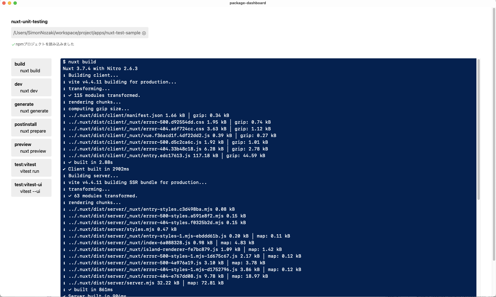

# Project Dashboard

npmのプロジェクトディレクトリを指定すると、npmスクリプトを読み込み、GUI上で実行できる。



## 仕様

- npmプロジェクトのディレクトリを指定して、package.jsonを読み込むことができる
  - プロジェクト名、使えるスクリプトが一覧化される
- 表示されたスクリプトを選択してその場で実行できる

## Setup

### Recommended IDE Setup

- [VS Code](https://code.visualstudio.com/) + [Tauri](https://marketplace.visualstudio.com/items?itemName=tauri-apps.tauri-vscode) + [rust-analyzer](https://marketplace.visualstudio.com/items?itemName=rust-lang.rust-analyzer)

### 開発

```sh
$ yarn tauri dev
```

# プロジェクトステータス

[package-dashboard-dev](https://github.com/users/simonNozaki/projects/1) にて追跡。
